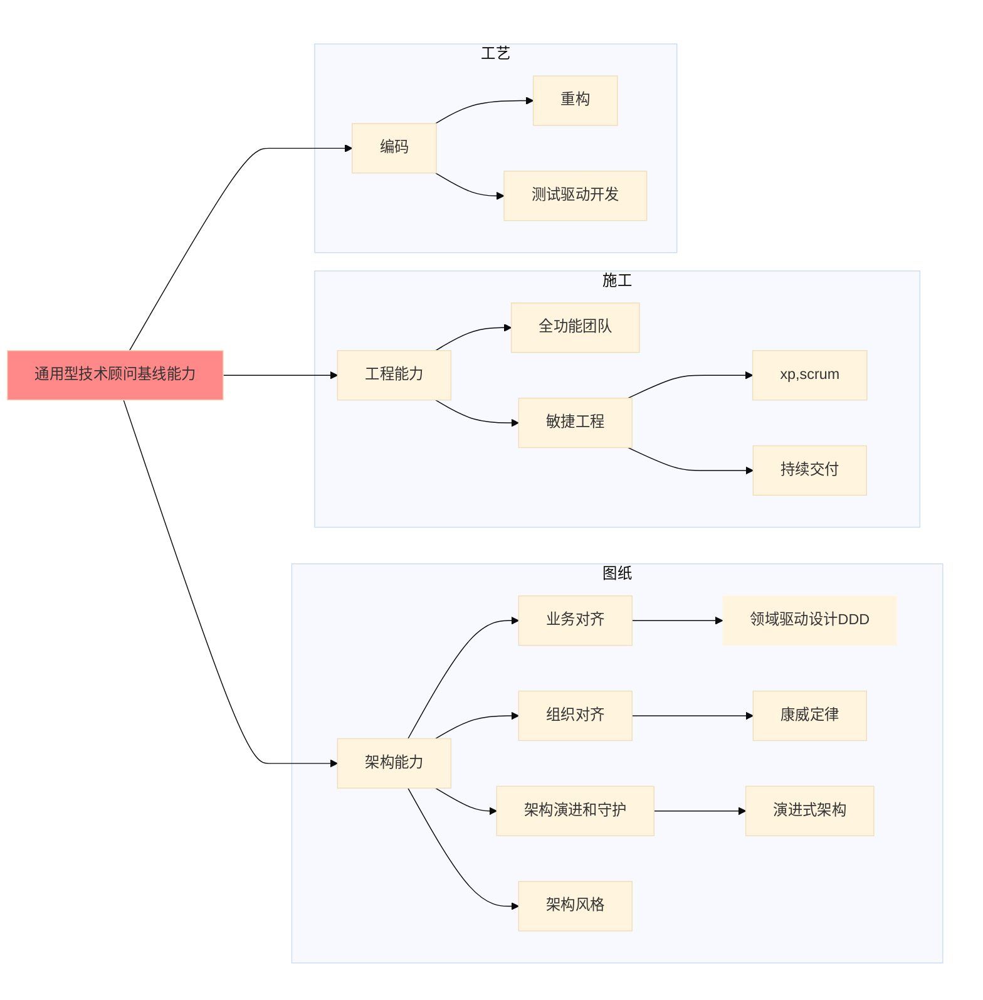
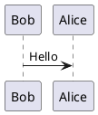

## 方法论
### 精益价值树 
[一棵小而美的“树”.pdf](/Volumes/TF0-work/00\ workwork/50\ 博客大赛)
[精益企业原则之：以产品为中心，而非交付项目](https://insights.thoughtworks.cn/lean-enterprise-principal/)
### DDD
[DDD社区](http://domain-driven-design.org/)
[DDD领域驱动战略篇（3） 上下文映射与协作](http://it.hzqiuxm.com/ddd%E9%A2%86%E5%9F%9F%E9%A9%B1%E5%8A%A8%E6%88%98%E7%95%A5%E7%AF%87%EF%BC%883%EF%BC%89/#i-11)
1.上下文之间的关系，依赖（支付的依赖，不能只看调用关系，双向调用时候，可以看听谁的）。注意：依赖关系可以主动去规划！
2.上下文的划分，二义性，业务完整性，质量属性/非功能需求
3.聚合的边界 ，业务一致性

### 优先级排序
### 设计思维
### 商业画布

## 前端
使用 Angular 制作精美的路由动画
<https://angular.cn/guide/route-animations>
## 架构
### 演进式架构
[浅谈演进式架构](https://poseiden.top/posts/41729/#more)
### 设计模式
[设计模式](https://refactoringguru.cn/design-patterns/catalog)
[23种JAVA设计模式详解](http://c.biancheng.net/design_pattern/)
### 中台
#### 中台 技术框架
[复杂度应对之道 - 阿里的COLA应用架构](https://www.edjdhbb.com/2019/02/23/%E5%A4%8D%E6%9D%82%E5%BA%A6%E5%BA%94%E5%AF%B9%E4%B9%8B%E9%81%93%20-%20%E9%98%BF%E9%87%8C%E7%9A%84COLA%E5%BA%94%E7%94%A8%E6%9E%B6%E6%9E%84/)
[cola扩展点的使用 业务-用例-场景](https://blog.csdn.net/tian583391571/article/details/106344892/)

### 微服务
[Service Mesh发展趋势(续)：棋到中盘路往何方](https://skyao.io/talk/201908-servicemesh-development-trend2/)

## 敏捷
[ThoughtWorks的敏捷开发](https://insights.thoughtworks.cn/agile-development-thoughtworks/)
大团队精益敏捷转型实践
[【敏捷进阶】有利才去做敏捷](https://www.bilibili.com/video/BV1fz411q7JB/)

## 数据
[数据智能读书雷达](https://blog.csdn.net/toafu/article/details/114132301)
### 数据迁移
[一丰迁移总结](https://www.icloud.com/keynote/0VvKQxtS7QkRmRgf5TKwN_myw)
[数据库迁移：概念和原则](https://cloud.google.com/architecture/database-migration-concepts-principles-part-1?hl=zh-cn#schema_changes)

## 工具
### 书写工具
[markdown语法](https://www.runoob.com/markdown/md-tutorial.html)
### debug 
Arthas 阿里的java诊断工具

## 培训
### inception-101
[材料](/Users/zhuo.wang/Library/Mobile\ Documents/com~apple~Keynote/Documents/inception-101)
1. 上下文与整体计划
2. 业务梳理和设计
3. 方案细化
4. 交付计划和汇报

### arch-101
### 敏捷工程实践系列

## 专题：
### 密码泄漏问题
git-secrets
[从薪火相传的密钥文件到“密码即服务”](https://cloud.tencent.com/developer/article/1563421)
### 登录与认证
[JWT与单点登录](https://www.jianshu.com/p/bc9264e1ddc3)
[AWS Cognito 登录系统蜕变之路](https://www.homuralovelive.com/posts/2021/03/28/new-sso-platform.html)
[OAuth系列篇之授权码的“推测”](https://zhuanlan.zhihu.com/p/126344082)
### 测试
[TDD is dead. Long live testing](https://dhh.dk/2014/tdd-is-dead-long-live-testing.html)
[缺陷管理实践分享](https://insights.thoughtworks.cn/how-to-manage-defect/)
[Mockito and JUnit 5 – Using ExtendWith](https://www.baeldung.com/mockito-junit-5-extension)
#### 自动化测试工具 
Selenium Cypress TestCafe
#### CMS
JAMStack Headless CMS 


## 技术顾问
层次和体系

[软件技术顾问的培养（一）：新技术顾问必读的十本书以及背后的思考](https://zhuanlan.zhihu.com/p/104637031)





## 需求管理/业务分析
需求治理 
原则 HAT OVER ROLE


## 商业
[Innosight-Transformation-20-Final] <27-商业>


## 常用工具命令

#### conda
```
conda install
conda search gatk=3.7
whick gatk
conda list
conda env list
conda activate xxx
conda deactivate 
conda remove -n myenv --all
conda create -n python2 python=2

conda config --show channels
conda config --set show_channel_urls yes
conda config --remove channels https://mirrors.tuna.tsinghua.edu.cn/anaconda/cloud/conda-forge/
```
