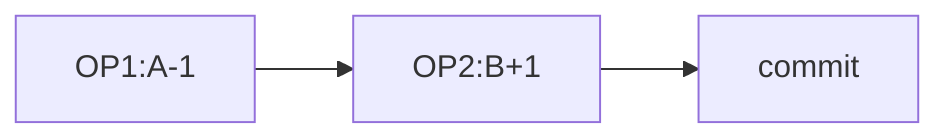

逻辑驱动学习系列 事务隔离级别

事务隔离级别是程序员会经常被问到的一个问题，我们知道mysql有4种事务隔离级别，那么为什么需要这些隔离级别，如何通过逻辑来推演而非死记硬背，本文试图理清该逻辑，让大家能够根据这里面的问题和解决问题的逻辑去掌握该知识。

**首先，为什么要有事务？**

事务主要是解决一致性问题而存在的，试想小A转1块钱给小B，那么**小A少1块** 和 **小B多一块** 应该都成功才算成功，如果其中有一个失败了而另一个成功，就会造成数据不一致，A钱少了但是B没有收到，或者B收到了但A没有减少，这样数据就出现了系统性的不一致。那么事务就是用来将这两个操作包在一起作为原子操作，要么都成功要么就回滚都失败。

**事务引发了哪些问题？**

假设数据库有以下资金表：
| 姓名 | 余额 |
| - | - |
| A | 1 |
| B | 0 |
程序 P1，两个操作组成事务，OP1 A-1 OP2 B+1

那么对于数据库而言，在P1的操作过程中，如果有进程P2读A的值，此时该如何处理呢，返回余额是多少才好，这就成为一个问题。

**思考1**

最简单的处理方式，就是P1改到哪，A是多少就返回多少。例如P1刚操作了OP1，那么P2读A的值数据库可以返回A=0，也就是说P1还没提交，P2就可以读到A最新的值。这种方式数据库就不需要做什么特殊隔离处理了，P2可以读到P1对A修改但未提交的值，这也就是**读未提交**。

但显而易见这样会引发很多问题，如果P1在执行OP2操作B时候失败了，那么需要回滚OP1操作，那么P1读到的A值就是错的，A从未变为0的状态，但P1读到了A值=0，这也就是**脏读**。

**思考2**
为了解决思考1中的问题，一个明显的方案是，只有P1提交之后，P2才能读到A最新的值，也就是P1提交后，P2读A值才能是0，这样看起来也更加合理。这也就是**读已提交**。这样是不是万事大吉了？这样还会存在一些问题，P2在一个事务中两次读A的值，第一次是A=1，第二次由于P1提交了，读到A=0，也就是说P2在一个事务里读A值结果不同，这个就叫**不可重复读**。

**思考3**
不可重复读会带来什么问题？从道理上讲，A值被修改了，我确实读到了最新的值，但是我一个事务重复读的值不一样，可能在某些场景下是不合适的。

不可重复读危害举例：银行做活动 事务a查询某地区余额1000以下送一包餐巾纸 生成名单 事务b小明余额500，存了1000，变成1500 事务a查询1000到2000送一桶油 生成名单 这样小明收到了2个礼品。

如果要解决这个问题，那么就要对事务的隔离型再次提升，这种隔离级别就是**可重复读**，让一个事务内重复读取到到值是一致的。

**思考4**
好了，至此大部分情况下的问题都已经解决了。最后还剩下一种是表中条数变化引发的问题，例如某值班表存了值班人员A，B， 程序要确保至少有一个人值班，当时A，B点击下班时候，程序统计表中人数，人数>1时候可以下班，并删除。这个时候两个程序都去判断当前值班人数为2，就可以下班了，但最终AB都下班了，导致无人值班。这种情况也称为**幻读**。这怎么解决呢，通过把所有操作**串行化**，自然可以解决这种问题，但显而易见，这将带来严重的性能损耗！MYSQL中通过引入**间隙锁**来解决幻读的问题。有兴趣的同学可以做深入的研究。

**最后**，你觉得DB默认使用哪种隔离级别会比较好呢，这个真是个鱼和熊掌不可兼得的问题，个人认为大部分场景读已提交就可以了，oracle的默认隔离级别就是**读已提交**,而MYSQL更严格一些，其默认隔离级别是**可重复读repeatable-read**。